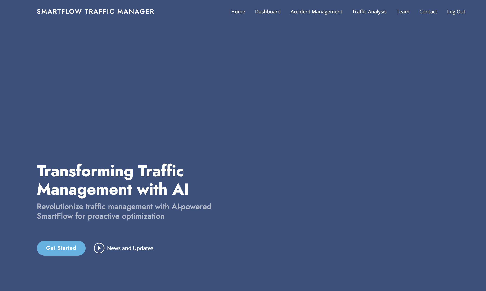
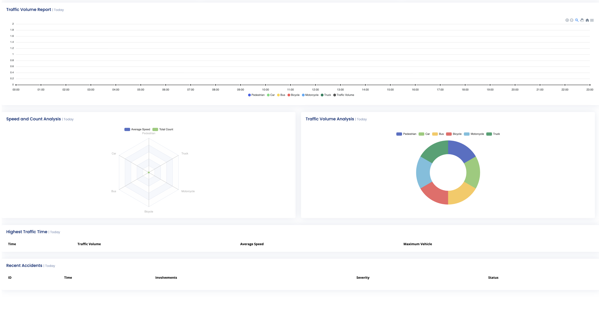
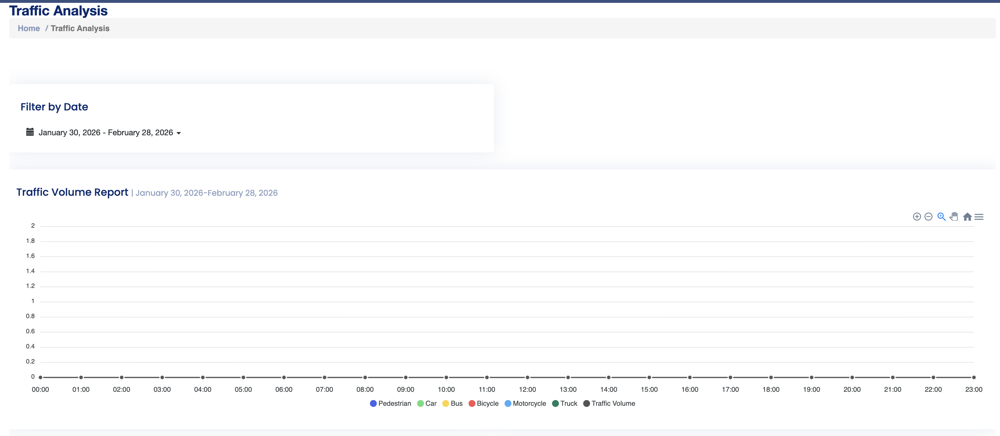
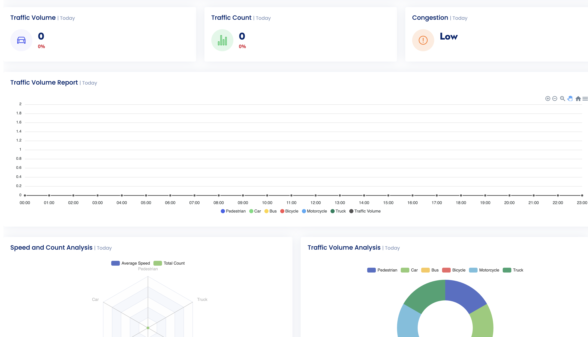

# 🚦 SmartFlow Traffic Manager

An AI-powered intelligent traffic management system designed to help
city authorities monitor, analyze, predict, and optimize urban traffic
flow in real time.

------------------------------------------------------------------------

## 🧩 Problem Statement

Urban cities face increasing traffic congestion, unpredictable
accidents, inefficient signal timing, and limited visibility into
real-time traffic behavior.

Key challenges include:

-   Lack of real-time traffic intelligence
-   Manual traffic signal control
-   Delayed accident detection
-   No predictive insights for congestion
-   Limited historical analytics for planning

City traffic authorities require an intelligent system that not only
monitors traffic but also predicts, optimizes, and alerts in real time.

------------------------------------------------------------------------

## 🎯 What This Project Does

SmartFlow Traffic Manager introduces an AI-driven solution that:

-   Detects vehicles and pedestrians using YOLO-based computer vision
-   Monitors live traffic feeds from cameras
-   Tracks congestion and movement patterns
-   Predicts future traffic conditions
-   Detects accidents automatically
-   Suggests optimized traffic signal timing
-   Provides analytics dashboards for decision-makers

The system empowers traffic management authorities to make faster and
smarter operational decisions.

------------------------------------------------------------------------

## 🧠 Core Principles

> Monitor → Analyze → Predict → Optimize → Alert

-   Real-time computer vision detection
-   Data-driven traffic forecasting
-   AI-assisted signal optimization
-   Incident detection and response
-   Historical data intelligence

------------------------------------------------------------------------

<!-- ## 📥 Video Explainer

`<a href="https://youtu.be/LonMaPdc2R" target="_blank">`{=html} ``{=html} `</a>`{=html} -->

------------------------------------------------------------------------

## 📥 Input Data

The system consumes:

-   Live YouTube traffic camera feeds
-   Video stream frames
-   Historical traffic records (stored in SQLite)
-   AI object detection model weights (YOLOv8)

------------------------------------------------------------------------

## 📤 Output

The platform provides:

-   Vehicle & pedestrian counts per hour
-   Congestion heat indicators
-   Accident alerts with location data
-   Traffic signal timing suggestions
-   Historical traffic analytics dashboards
-   Future traffic condition forecasting

------------------------------------------------------------------------

## 🚦 Core Features

### 📊 Traffic Dashboard

Real-time vehicle counts, pedestrian density, congestion zones, and
directional movement analysis.

### 👁 AI-Based Traffic Monitoring

Live video feed with object detection overlays and map-based route
visualization.

### 📈 Traffic Analysis

Historical insights filtered by date range and metrics for policy
decisions.

### 🔮 Traffic Condition Forecasting

Predictive vehicle and congestion trends for upcoming hours.

### 🚥 Dynamic Traffic Signal Optimization

AI-based adaptive signal timing suggestions.

### 🚨 Incident Management

Automatic accident detection and real-time alert generation.

------------------------------------------------------------------------

## 🔁 Automation & Future Enhancements

This system can be extended with:

-   CloudWatch metrics for latency, error rates, and API timing
-   Real-time log aggregation
-   Cost monitoring and alerting
-   Endpoint performance monitoring
-   Containerized deployment (Docker + Kubernetes)
-   Cloud-based scaling architecture

Future-ready for production-grade infrastructure monitoring and
observability.

------------------------------------------------------------------------

## 🔄 System Flow

``` text
Live Camera Feed
        ↓
Frame Extraction
        ↓
YOLO Object Detection
        ↓
Traffic Data Processing
        ↓
Database Storage
        ↓
Dashboard & Forecast Engine
        ↓
Signal Optimization + Alerts
```

------------------------------------------------------------------------

## ⚙️ Requirements

-   Python 3.10+
-   Virtual Environment
-   YOLOv8 model weights
-   SQLite database

Install dependencies:

``` bash
pip install -r requirements.txt
```

------------------------------------------------------------------------

## ▶️ How to Run

1.  Clone the repository
2.  Navigate to project folder
3.  Create virtual environment:

``` bash
python -m venv .venv
```

4.  Activate environment
5.  Install dependencies:

``` bash
pip install -r requirements.txt
```

6.  Initialize database:

``` bash
flask --app sftm_server init-db
```

7.  Run application:

``` bash
flask --app sftm_server run --debug --port=5000
```

8.  Open browser:

```{=html}
<!-- -->
```
    http://127.0.0.1:5000

------------------------------------------------------------------------

## 📩 Contact

| Name              | Details                             |
|-------------------|-------------------------------------|
| **👨‍💻 Developer**  | Sachin Arora                      |
| **📧 Email**       | [sachnaror@gmail.com](mailto:sachnaror@gmail.com) |
| **📍 Location**    | Noida, India                       |
| **📂 GitHub**      | [github.com/sachnaror](https://github.com/sachnaror) |
| **🌐 Website**     | [https://about.me/sachin-arora](https://about.me/sachin-arora) |
| **📱 Phone**       | [+91 9560330483](tel:+919560330483) |


------------------------------------------------------------------------

## End Result









